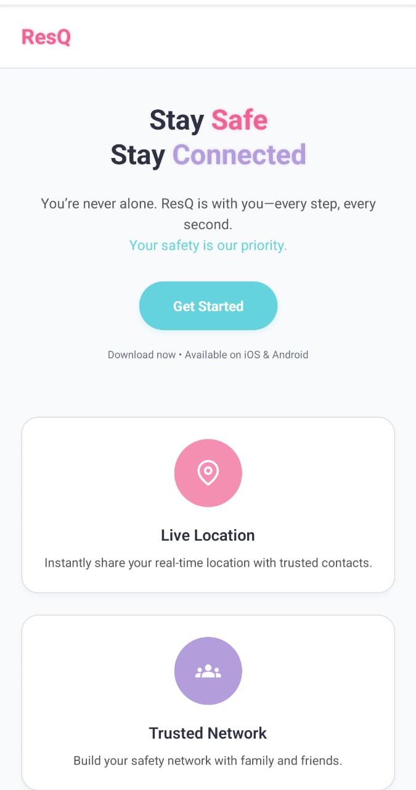
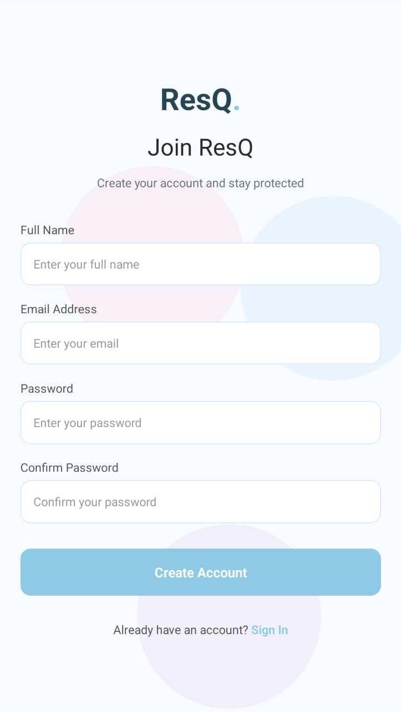
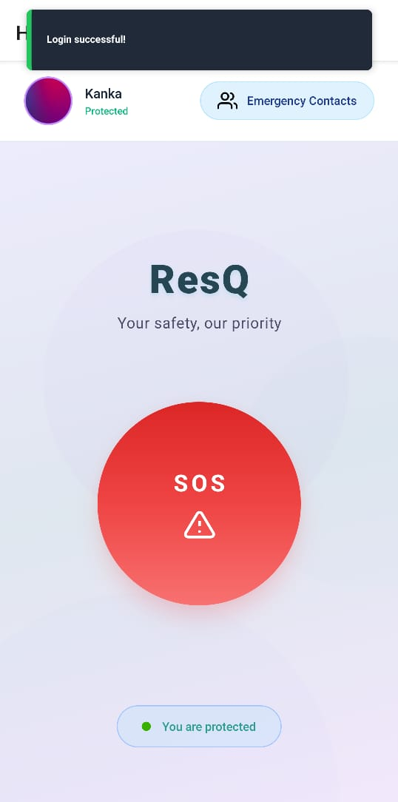
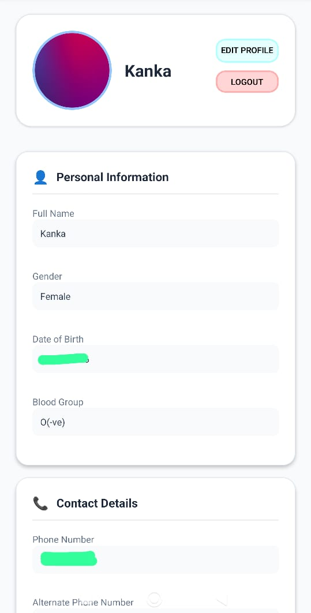
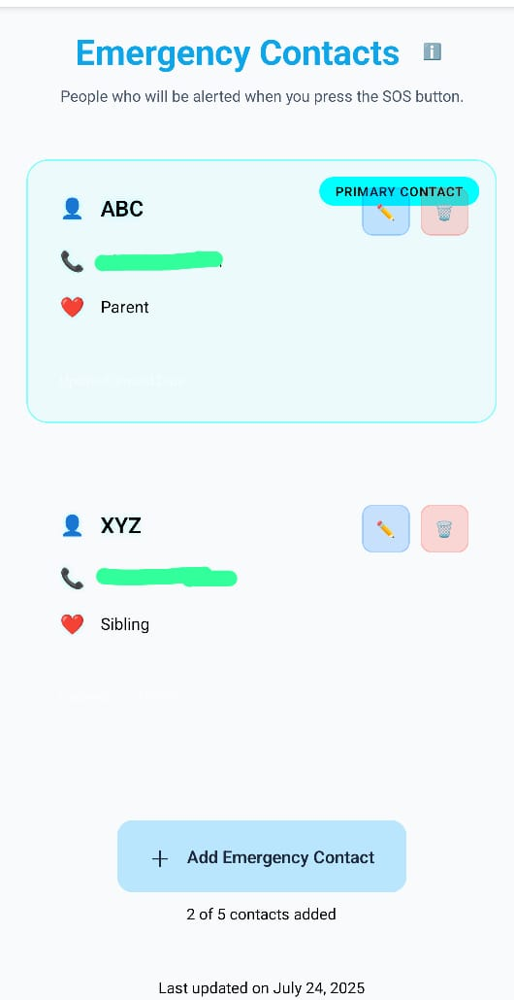
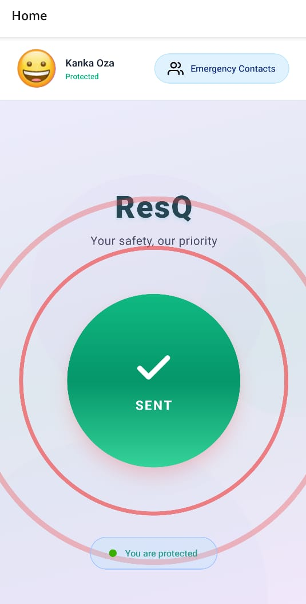
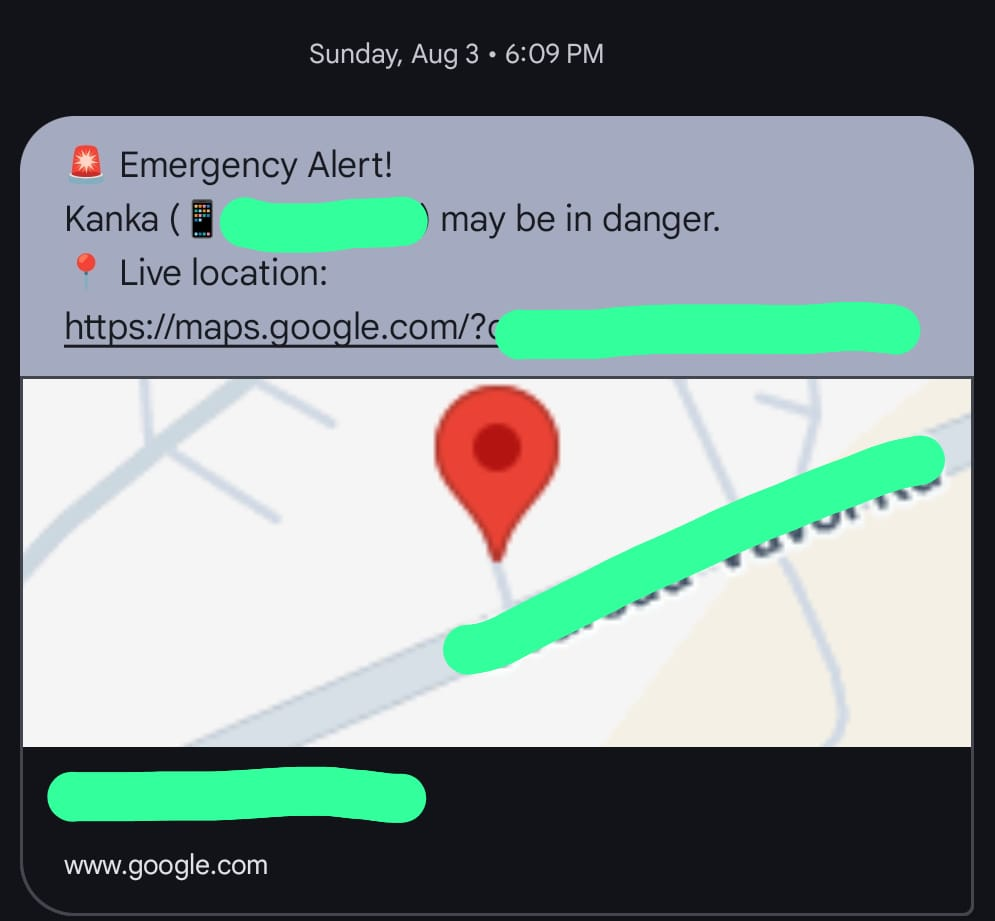

# ResQ – Women's Safety App

[](https://github.com/kankaa16/ResQ/stargazers)
[](https://github.com/kankaa16/ResQ/network/members)
[](https://github.com/kankaa16/ResQ)
[](https://opensource.org/licenses/MIT)
[](https://expo.dev/)

---

## 🚨 Project Overview

ResQ is a robust, full-stack mobile safety application meticulously designed to provide immediate assistance to women during emergencies. Leveraging the power of modern mobile technology, ResQ empowers users with a discreet and effective tool for personal safety. With a single **Panic Button** tap, the app instantly dispatches an SMS containing the user's **live location** to pre-registered **emergency contacts**, ensuring help is always just a second away.

---

## 📥 Download

👉 [Download Universal APK](https://github.com/kankaa16/ResQ/releases/download/v1.0.0/ResQ.apk)


## 🧠 Motto

> *Empowering safety with one tap. Help is just a second away.*

ResQ aims to provide quick, reliable, and discreet emergency assistance. It allows users to save trusted contacts, manage their emergency details, and instantly trigger alerts with real-time location.

---

## ✨ Features

*   **One-Tap Panic Button:** Instantly trigger an emergency alert.
*   **Live Location Sharing:** Sends real-time GPS coordinates via SMS to emergency contacts.
*   **Emergency Contact Management:** Add, edit, and prioritize trusted contacts.
*   **Secure User Authentication:** Implements JWT (JSON Web Token) for secure user registration and login.
*   **Personal Profile Management:** Users can store critical medical information, allergies, blood group, and other vital details for first responders.
*   **Intuitive User Interface:** A clean, user-friendly design built with React Native.
*   **Backend Integration:** Seamless communication with a dedicated backend for data persistence and real-time updates.

---

## ⚙️ How It Works

ResQ operates on a simple yet effective mechanism to ensure rapid response:

1.  **User Registration/Login:** Users securely register or log in to the application using JWT authentication, ensuring personalized and secure access.
2.  **Emergency Contact Setup:** Users can easily add, edit, and designate primary emergency contacts within their profile settings.
3.  **Panic Button Activation:** Upon pressing the "Panic Button":
    *   A subtle ripple animation provides immediate visual feedback to the user.
    *   The app retrieves the user's current live GPS location.
    *   An SMS containing the live location link (e.g., Google Maps link) is sent to all pre-registered emergency contacts.
    *   The user's last known location and emergency status are updated in the backend database.
4.  **Profile Management:** Users can update their personal and medical information, which can be crucial for emergency services.

---

## 📸 Screenshots

<p align="center">
  
  
  
  
</p>

<p align="center">
  
  
  
</p>
---

## 🛠️ Tech Stack

ResQ is built using a modern, robust technology stack, primarily focused on JavaScript for both frontend and backend development.

### Frontend (Mobile App)

*   **React Native:** A JavaScript framework for building native mobile apps.
*   **Expo:** A framework and platform for universal React applications, simplifying development and deployment.
*   **React Navigation:** For handling navigation and routing within the app.
*   **`@react-native-async-storage/async-storage`:** Persistent key-value storage for React Native.
*   **`axios`:** Promise-based HTTP client for making API requests to the backend.
*   **`@expo/vector-icons`:** Pre-made icons for a richer UI.
*   **`@react-native-picker/picker`:** Native select/picker component.

### Backend (API Server)

*(Assumed based on project structure and dependencies, typically Node.js with Express)*

*   **Node.js:** JavaScript runtime for server-side logic.
*   **Express.js:** A fast, unopinionated, minimalist web framework for Node.js.
*   **MongoDB (or similar NoSQL DB):** For storing user data, emergency contacts, location history, and profile information.
*   **JWT (JSON Web Tokens):** For secure authentication and authorization.
*   **Twilio (or similar SMS Gateway API):** For sending SMS messages with live location. *(This would be an external dependency for the backend)*

---

## 🚀 Installation

To get ResQ up and running on your local machine, follow these steps:

### Prerequisites

Make sure you have the following installed:

*   [Node.js](https://nodejs.org/) (LTS version recommended)
*   [npm](https://www.npmjs.com/get-npm) or [Yarn](https://yarnpkg.com/)
*   [Expo CLI](https://docs.expo.dev/get-started/installation/): `npm install -g expo-cli`

### 1. Clone the Repository

```bash
git clone https://github.com/kankaa16/ResQ.git
cd ResQ
```

### 2. Frontend Installation (Mobile App)

Navigate to the root directory of the cloned repository and install dependencies:

```bash
npm install
# or
yarn install
```

### 3. Backend Installation & Setup (Assumed structure)

The `backend` folder suggests a separate server. You'll need to set up the backend server to handle user authentication, contact management, and location updates.

1.  Navigate into the `backend` directory:
    ```bash
    cd backend
    ```
2.  Install backend dependencies:
    ```bash
    npm install
    # or
    yarn install
    ```
3.  **Environment Variables:** Create a `.env` file in the `backend` directory based on a `.env.example` (if provided, otherwise create one) and configure necessary environment variables such as:
    *   `PORT=5000` (or your desired port)
    *   `MONGO_URI=mongodb://localhost:27017/resq_db` (your MongoDB connection string)
    *   `JWT_SECRET=your_jwt_secret_key`

4.  Start the backend server:
    ```bash
    npm start
    # or
    yarn start
    ```
    The backend server should now be running, typically on `http://localhost:5000`.

### 4. Run the Mobile App

From the root directory of the repository (where `package.json` for the frontend is located):

```bash
expo start
```

This will open a new tab in your browser with Expo Dev Tools. You can then:
*   Scan the QR code with the Expo Go app on your phone.
*   Run on an Android emulator (`a` key in terminal).
*   Run on an iOS simulator (`i` key in terminal - macOS only).

---

## 💡 Usage

Once the app is running and the backend server is active:

1.  **Register/Login:** Create a new account or log in with existing credentials.
2.  **Add Emergency Contacts:** Navigate to the contacts section and add phone numbers of your trusted contacts.
3.  **Update Profile:** Fill in your personal and medical information in the profile section.
4.  **Test the Panic Button:** In a safe environment, tap the "Panic Button" to simulate an emergency. Verify that your emergency contacts receive the SMS with your live location.

### Example: Simplified `App.js` Structure

```javascript
import React from 'react';
import { NavigationContainer } from '@react-navigation/native';
import { createNativeStackNavigator } from '@react-navigation/native-stack';

import LoginScreen from './screens/LoginScreen';
import RegisterScreen from './screens/RegisterScreen';
import HomeScreen from './screens/HomeScreen';
import ProfileScreen from './screens/ProfileScreen';
import ContactsScreen from './screens/ContactsScreen';

const Stack = createNativeStackNavigator();

export default function App() {
  return (
    <NavigationContainer>
      <Stack.Navigator initialRouteName="Login">
        <Stack.Screen name="Login" component={LoginScreen} options={{ headerShown: false }} />
        <Stack.Screen name="Register" component={RegisterScreen} options={{ headerShown: false }} />
        <Stack.Screen name="Home" component={HomeScreen} options={{ title: 'ResQ' }} />
        <Stack.Screen name="Profile" component={ProfileScreen} options={{ title: 'My Profile' }} />
        <Stack.Screen name="Contacts" component={ContactsScreen} options={{ title: 'Emergency Contacts' }} />
        {/* Add more screens as needed */}
      </Stack.Navigator>
    </NavigationContainer>
  );
}
```

---

## 📚 API Documentation (Backend)

The backend API handles all data persistence and communication for the ResQ app. Key endpoints would typically include:

*   **Authentication:**
    *   `POST /api/auth/register`: User registration.
    *   `POST /api/auth/login`: User login.
*   **User Profile:**
    *   `GET /api/users/profile`: Retrieve user profile.
    *   `PUT /api/users/profile`: Update user profile (medical info, etc.).
*   **Emergency Contacts:**
    *   `GET /api/contacts`: Retrieve all emergency contacts for the user.
    *   `POST /api/contacts`: Add a new emergency contact.
    *   `PUT /api/contacts/:id`: Update an existing contact.
    *   `DELETE /api/contacts/:id`: Delete a contact.
*   **Emergency Trigger:**
    *   `POST /api/emergency/panic`: Trigger the panic alert, send SMS, and update location.
    *   `POST /api/emergency/location-update`: Update user's live location.

For detailed API specifications (request/response formats, authentication requirements), please refer to the `README.md` file within the `backend/` directory (if available) or the server's source code.

---

## 🤝 Contributing

Contributions are what make the open-source community such an amazing place to learn, inspire, and create. Any contributions you make are **greatly appreciated**.

If you have a suggestion that would make this better, please fork the repo and create a pull request. You can also simply open an issue with the tag "enhancement".

1.  Fork the Project
2.  Create your Feature Branch (`git checkout -b feature/AmazingFeature`)
3.  Commit your Changes (`git commit -m 'Add some AmazingFeature'`)
4.  Push to the Branch (`git push origin feature/AmazingFeature`)
5.  Open a Pull Request

---

## 📄 License

This project is licensed under the MIT License - see the [LICENSE](LICENSE) file for details.

```
MIT License

Copyright (c) 2025 kankaa16

Permission is hereby granted, free of charge, to any person obtaining a copy
of this software and associated documentation files (the "Software"), to deal
in the Software without restriction, including without limitation the rights
to use, copy, modify, merge, publish, distribute, sublicense, and/or sell
copies of the Software, and to permit persons to whom the Software is

